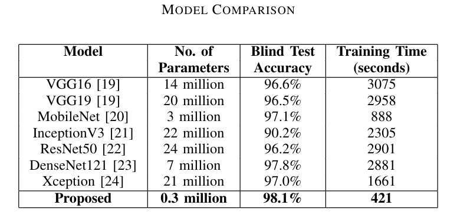

# Identification of Coronavirus & Pneumonia from Chest X-ray Scans using Deep Multilayered CNN

The proposed model is trained on NVIDIA RTX 2060 GPU paired with a quad-core processor \& 16gb of DDR4 memory clocked at 3000mHz.
\
\
The research paper is going to publised soon. Once the paper is published, the link of the paper will be shown here.
\
\

## Dataset source : 
* J. P. Cohen, P. Morrison, and L. Dao, “Covid-19 image data collection,” arXiv 2003.11597, 2020. [Online]. Available: https://github.com/ieee8023/covid-chestxray-dataset
* https://github.com/agchung/Actualmed-COVID-chestxray-dataset
* S. Alqudah, Ali Mohammad; Qazan, “Augmented covid-19 x-ray images dataset,” Mendeley Data, V4, 2020.
* P. Mooney, “Chest x-ray images (pneumonia),” https://www.kaggle.com/paultimothymooney/chest-xray-pneumonia

## Run in your own machine :
* `git clone https://github.com/Shrabana97/Identification-of-Coronavirus-and-Pneumonia-from-Chest-X-ray-Scans-using-Deep-Multilayered-CNN.git`
* `cd Identification-of-Coronavirus-and-Pneumonia-from-Chest-X-ray-Scans-using-Deep-Multilayered-CNN`
* `pip3 install -r requirements.txt` (install required libraries)
* Download the dataset from the [Google-Drive link]((https://drive.google.com/file/d/1OjT6BfNsRRB_nX2O_aAz6-3DRlcIFZiK/view?usp=sharing)).
* Upon unzipping the .zip file 'train' folder will be created where all the classes and their respective images are stored.
* To split the data run `python3 split.py` and follow the on-screen instructions.
    *   It will ask the address of the 'train' folder and will store that address in `path_of_train_dir.txt`. 
* To resize the data run `python3 pre-process.py`.
* To perform classical data augmentation on the training data run `python3 augment.py`.
* To train and create the model run `python3 train.py`.
    * Model and the training details will be stored in `result` directory.